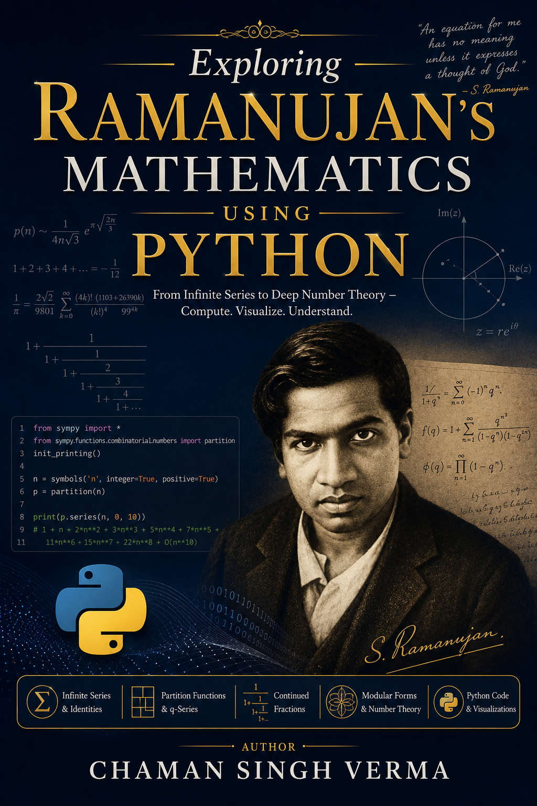

This repository contains a self-contained, publication-ready mathematical and computational package that verifies several major discoveries of G. H. Hardy's legendary collaborator, **Srinivasa Ramanujan (1887–1920)**.

The project combines historical mathematical theory with modern software engineering practices, providing a formal academic paper, a student-friendly laboratory guide, and an independent Python verification suite with zero external dependencies.

---

## 📂 Project Directory Structure

*   [ramanujan.tex](file:///Users/csv610/Projects/Ramanujan/ramanujan.tex) / [ramanujan.pdf](file:///Users/csv610/Projects/Ramanujan/ramanujan.pdf) — The formal academic paper, structured in standard AMS-LaTeX (`amsart`) format for arXiv preprints.
*   [ramanujan_student_guide.tex](file:///Users/csv610/Projects/Ramanujan/ramanujan_student_guide.tex) / [ramanujan_student_guide.pdf](file:///Users/csv610/Projects/Ramanujan/ramanujan_student_guide.pdf) — An accessible, educational companion guide for high school and undergraduate students, featuring 11 computational lab exercises and explorations.
*   [ramanujan_codes.py](file:///Users/csv610/Projects/Ramanujan/ramanujan_codes.py) — The core Python module containing all simulations, recurrences, and polynomial algebra helper functions.
*   [test_ramanujan.py](file:///Users/csv610/Projects/Ramanujan/test_ramanujan.py) — A 15-test unit suite verifying the mathematical accuracy of all Python implementations.

---

## 🧬 Topics Verified & Explored

1.  **Ramanujan's Series for $\pi$:** Simulating the 1914 infinite series, which converges at a rate of 8 correct decimal places per term.
2.  **Partition Numbers & Congruences:** Verifying Ramanujan's divisibility rules modulo $5$, $7$, and $11$.
3.  **Rogers–Ramanujan Identities:** Demonstrating the bijection between partitions with parts differing by at least 2 and parts congruent to $\pm 1 \pmod 5$.
4.  **Rogers–Ramanujan Continued Fractions:** Evaluating nested fraction convergence and its relation to the Golden Ratio ($\phi - 1$).
5.  **Divisor Functions & Highly Composite Numbers (HCNs):** Identifying the "most divisible" numbers (e.g., $12$, $24$, $60$), which play key roles in Fast Fourier Transform (FFT) algorithms.
6.  **Mock Theta Functions:** Generating coefficients for functions that modern physicists use to calculate black hole microstates and entropy in string theory.
7.  **The Ramanujan Tau Function:** Checking multiplicative properties ($\tau(mn) = \tau(m)\tau(n)$) and verifying bounds ($\left|\tau(p)\right| \le 2p^{11/2}$) linked to the Langlands Program.

---

## 🚀 Getting Started

### Prerequisites
You only need a standard installation of **Python 3.x** and a **LaTeX distribution** (like TeX Live, MacTeX, or MiKTeX) to compile the documents. No third-party Python packages are required.

### 1. Run the Computational Demos
To run the full suite of simulations and print out the numerical verifications:
```bash
python3 ramanujan_codes.py
```

### 2. Run the Unit Test Suite
To verify the math functions against standard reference values:
```bash
python3 -m unittest test_ramanujan.py
```

### 3. Compile the Documents
To compile the formal paper and the student guide to PDFs:
```bash
pdflatex ramanujan.tex
pdflatex ramanujan_student_guide.tex
```
*(Note: It is recommended to compile twice to resolve cross-references correctly.)*

---

## ✍️ Author
*   **Chaman Singh Verma** — Independent Researcher
*   Email: [csv610@gmail.com](mailto:csv610@gmail.com)
